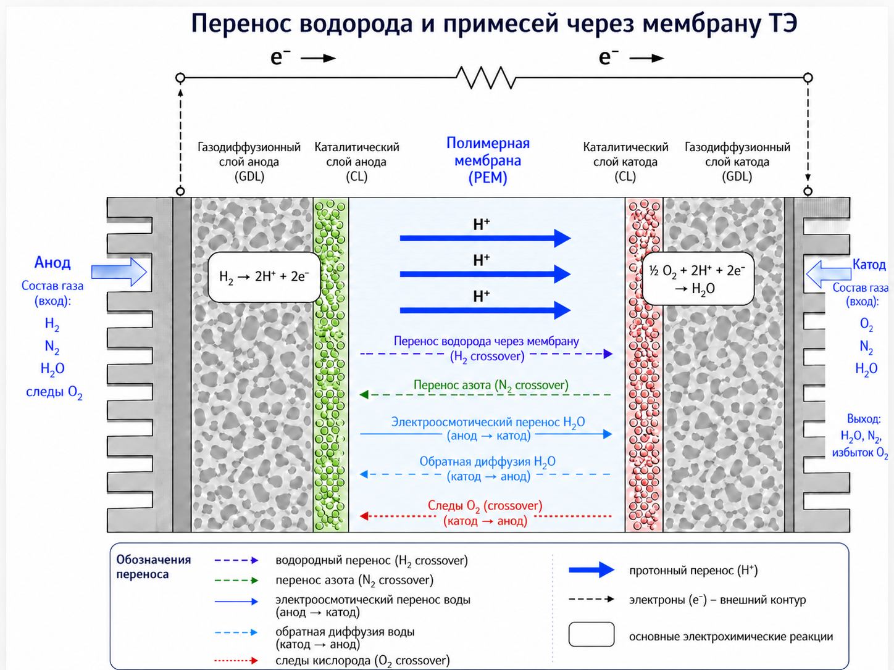

# MEMB impurity model

Учебно-исследовательский проект по моделированию переноса газов, воды и примесей через мембрану PEMFC.

Расчетная схема собрана по открытым литературным источникам и реализована на Python. 
Для проверки корректности результаты сопоставлены с расчетом квазимтационарной модели топливного элемента в Simcenter Amesim.

## Краткое описание

В репозитории реализована модель мембранного блока PEMFC. Она рассчитывает:

- перенос кислорода `O2` от катода к аноду;
- перенос азота `N2` от катода к аноду;
- перенос водорода `H2` от анода к катоду;
- диффузионный перенос воды от катода к аноду;
- электроосмотический перенос воды от анода к катоду;
- реакционный расход водорода по закону Фарадея;
- компонентные молярные потоки в формате, близком к выводу Amesim;
- накопление примесей в анодном контуре при закрытых клапанах удаления примесей.



Модель предназначена для учебных и исследовательских целей. Это не копия внутренней модели Amesim, а самостоятельная Python-реализация, собранная по литературным источникам и сопоставленная с инженерной CAE-моделью.

## Проект демонстрирует

1. **Постановку задачи**  
   Рассматривается анодный контур PEMFC: мембранный перенос компонентов, рециркуляция водорода, влагоотделение и накопление примесей.

2. **Переход от физики к коду**  
   В notebook последовательно описаны входные параметры, структуры данных, вспомогательные корреляции, основная функция расчета и табличный вывод результатов.

3. **Работу с CAE-логикой**  
   Входы и выходы оформлены так, чтобы результаты Python-модели можно было сравнивать с расчетом в Simcenter Amesim.

4. **Воспроизводимость**  
   Все ключевые параметры вынесены в начало notebook, расчет выполняется сверху вниз, результаты выводятся в таблицы.

5. **Документирование инженерной модели**  
   В notebook отдельно описаны физический смысл уравнений, знаковая конвенция потоков и ограничения модели.

## Структура репозитория

```text
.
├── README.md
├── requirements.txt
├── .gitignore
├── notebooks/
│   └── MEMB_impurity_model.ipynb
├── src/
│   └── memb_impurity_model.py
└── docs/
    ├── hr_summary.md
    └── model_notes.md
```

## Быстрый запуск

Установка зависимостей:

```bash
pip install -r requirements.txt
```

Запуск notebook:

```bash
jupyter notebook notebooks/MEMB_impurity_model.ipynb
```

Запуск расчета как Python-скрипта:

```bash
python src/memb_impurity_model.py
```

Для запуска Python-модуля требуется Python 3.10 или новее.

## Основные входные параметры

В начале notebook заданы параметры БТЭ, состояния анода и катода, расчетный ток и параметры закрытой рециркуляции.

### Параметры БТЭ

- `Ncell` — количество ячеек БТЭ;
- `Scell` — активная площадь одной ячейки, см²;
- `lmemb` — толщина мембраны, мм;
- `EW` — эквивалентная масса иономера, г/моль;
- `rho_memb` — плотность материала мембраны, кг/м³.

### Состояния анода и катода

Для каждой стороны мембраны задаются:

- температура газовой смеси, К;
- абсолютное давление смеси, Па;
- молярные доли `H2`, `N2`, `H2O`, `O2`.

### Расчетный режим

- `CURRENT_A` — ток БТЭ, А;
- `ANODE_STOICH_LAMBDA` — стехиометрическое число на входе в БТЭ;
- `WATER_SEPARATOR_EFF_PERCENT` — коэффициент после влагоотделителя, %;
- `ACCUMULATION_TIME_S` — горизонт накопления примесей, с.

## Основные блоки notebook

### 1. Базовые параметры

В первой части задаются параметры БТЭ, составы газовых смесей, давления, температуры, ток и физические константы.

### 2. Структуры данных

В модели используются три основные структуры:

- `BTEParams` — параметры БТЭ и мембраны;
- `GasState` — состояние газовой смеси на одной стороне мембраны;
- `SC3Result` — результат расчета потоков и внутренних переменных.

Внутри `BTEParams` дополнительно рассчитываются:

- суммарная активная площадь БТЭ;
- толщина мембраны в СИ;
- концентрация фиксированных сульфогрупп в мембране.

### 3. Вспомогательные функции мембраны

В notebook реализованы функции для расчета:

- давления насыщенного водяного пара;
- активности воды;
- водосодержания мембраны;
- объемной доли воды в мембране;
- коэффициента электроосмотического переноса воды;
- коэффициента диффузии воды в мембране.

В модели использованы эмпирические корреляции, применяемые в расчетных моделях PEMFC:

- расширенная корреляция Антуана для давления насыщенного водяного пара;
- корреляция Springer–Zawodzinski–Gottesfeld для водосодержания мембраны Nafion.

### 4. Основная функция модели `MEMB`

Основная функция `sc3_membrane_model(...)` рассчитывает перенос компонентов через мембрану и внутренние переменные модели.

Для каждой стороны мембраны используются стандартные соотношения для парциальных давлений:

$$
p_i = x_i p
$$

Разности парциальных давлений задают движущую силу для газового crossover.

Газовый crossover для `O2`, `N2` и `H2` описан линейной зависимостью по перепаду парциальных давлений:

$$
\dot n_i = k_i \Delta p_i
$$

где:

- $\dot n_i$ — молярный поток компонента через мембрану;
- $k_i$ — эффективный пермеанс мембраны для данного компонента;
- $\Delta p_i$ — разность парциальных давлений газа по разные стороны мембраны.

Эффективный пермеанс включает свойства материала мембраны, ее площадь и толщину:

$$
k_i =
P_i(\phi_{w,\mathrm{avg}})
\exp\left[
\frac{E_i}{R}
\left(
\frac{1}{303} - \frac{1}{T}
\right)
\right]
\frac{A}{l_m}
$$

где:

- $P_i(\phi_{w,\mathrm{avg}})$ — проницаемость материала мембраны, зависящая от средней объемной доли воды;
- $A$ — активная площадь мембраны;
- $l_m$ — толщина мембраны;
- $T$ — температура мембраны;
- $E_i$ — эмпирический температурный коэффициент;
- $R$ — универсальная газовая постоянная.

Физический смысл:

- большая площадь мембраны повышает перенос газов;
- меньшая толщина мембраны повышает перенос газов;
- гидратация мембраны влияет на газопроницаемость материала;
- температурная поправка задается экспоненциальной зависимостью по Аррениусу.

### 5. Перенос воды через мембрану

Диффузионный поток воды в сторону анода рассчитывается через градиент водосодержания мембраны:

$$
\dot n_{H_2O,\mathrm{diff \to anode}} =
D_w c_{\mathrm{SO_3}}
\frac{\lambda_c - \lambda_a}{l_m} A
$$

где:

- $D_w$ — коэффициент диффузии воды в мембране;
- $c_{\mathrm{SO_3}}$ — концентрация фиксированных кислотных центров в мембране;
- $\lambda_c$, $\lambda_a$ — водосодержание мембраны со стороны катода и анода;
- $l_m$ — толщина мембраны;
- $A$ — активная площадь.

Электроосмотический перенос воды в сторону катода считается как:

$$
\dot n_{H_2O,\mathrm{drag \to cathode}} =
n_{\mathrm{drag}}
\frac{I N_{\mathrm{cell}}}{F}
$$

Коэффициент $n_drag$ показывает количество воды, переносимой через мембрану на единицу протонного заряда. В PEMFC один моль прореагировавшего водорода соответствует двум молям электронов и двум молям переносимого протонного заряда.

Суммарный поток воды в сторону анода:

$$
\dot n_{H_2O,\mathrm{net \to anode}} =
\dot n_{H_2O,\mathrm{diff \to anode}}
-
\dot n_{H_2O,\mathrm{drag \to cathode}}
$$

### 6. Реакционный расход водорода

Расход водорода на аноде рассчитывается по закону Фарадея:

$$
\dot n_{H_2,\mathrm{cons}} =
-\frac{I N_{\mathrm{cell}}}{2F}
$$

Минус означает, что водород удаляется из анодного газового объема как реагирующий компонент. Число 2 в знаменателе связано с тем, что на один моль `H2` приходится два моля электронов.

### 7. Потоки и накопление примесей

Отдельный блок переводит результат `MEMB` в упорядоченный набор компонентных молярных потоков:

1. `O2`;
2. `N2`;
3. `H2O`;
4. `H2`.

Для водорода выводится суммарный источник на аноде:

$$
\dot n_{H_2,\mathrm{source}} =
\dot n_{H_2,\mathrm{cons}} -
\dot n_{H_2,\mathrm{cross}}
$$

Также рассчитывается суммарный массовый поток источника:

$$
\dot m_3 = \sum_i \dot n_i M_i
$$

### 8. Закрытая рециркуляция анода

В notebook добавлен расчет квазистационарного накопления примесей при закрытых клапанах удаления примесей.

Учтены:

- относительная влажность на аноде;
- влагоотделитель;
- полное восполнение реакционного расхода `H2` чистым водородом;
- требуемый расход на входе в БТЭ через стехиометрическое число;
- накопление `O2`, `N2` и `H2O` за заданный временной горизонт.

Основные соотношения:

$$
\dot n_{H_2,\mathrm{makeup}} =
|\dot n_{H_2,\mathrm{cons}}|
$$

$$
\dot n_{H_2,\mathrm{inlet\ to\ BTE}} =
\lambda |\dot n_{H_2,\mathrm{cons}}|
$$

$$
\dot n_{H_2,\mathrm{required\ from\ recirc}} =
\dot n_{H_2,\mathrm{inlet\ to\ BTE}} -
\dot n_{H_2,\mathrm{makeup}}
$$

Влагоотделитель задается через изменение относительной влажности:

$$
humid_{out,raw} =
eff \cdot humid_{in}
$$

После влагоотделителя влажность ограничивается насыщением, затем пересчитывается молярная доля водяного пара в газовой фазе.

## Принятая знаковая конвенция

- $n_o2_to_anode_mol_s > 0$ означает, что `O2` идет в анод;
- $n_n2_to_anode_mol_s > 0$ означает, что `N2` идет в анод;
- $n_h2_to_cathode_mol_s > 0$ означает, что `H2` идет в катод;
- $n_h2o_net_to_anode_mol_s > 0$ означает, что суммарно вода идет в анод;
- отрицательный $n_h2_consumption_mol_s$ означает реакционный расход водорода на аноде.

## Основные результаты

Модель формирует три группы результатов:

1. таблицу внутренних переменных мембраны;
2. таблицу компонентных потоков в формате, близком к Amesim;
3. таблицу накопления примесей при закрытых клапанах удаления примесей.

Таблицы позволяют быстро проверить:

- направления потоков;
- порядки величин газового crossover;
- вклад диффузии и электроосмотического переноса воды;
- скорость накопления `O2`, `N2` и `H2O` в анодном контуре;
- влияние влагоотделителя на водяной пар в рециркуляции.

## Область применимости

Модель предназначена для учебной, исследовательской и демонстрационной работы:

- разбор физики переноса через мембрану PEMFC;
- проверка порядков величин компонентных потоков;
- оценка накопления примесей в анодном контуре;
- подготовка инженерной логики для автоматизации расчетов;
- демонстрация перехода от CAE-модели к воспроизводимому Python-расчету.

Модель не заменяет полный динамический расчет PEMFC-системы и не описывает:

- распределенные поля внутри ячейки;
- детальную электрохимию;
- деградацию мембраны;
- двухфазный перенос воды;
- полную динамику объемов анодного контура;
- детальную геометрию каналов и газодиффузионных слоев.
- 
## Благодарности

Выражаю особую благодарность Гаврилову Ивану Васильевичу за помощь в разборе уравнений переноса модели PEMFC. 

## Благодарности

Выражаю особую благодарность Гаврилову Ивану Васильевичу за помощь в разборе уравнений переноса модели PEMFC. 

## Литературная база

Физический смысл уравнений в скрипте опирается на классические и обзорные работы по PEMFC:

- Springer, Zawodzinski, Gottesfeld — базовая модель PEMFC, водосодержание мембраны и water drag;
- Bernardi, Verbrugge — математическая модель solid-polymer-electrolyte fuel cell;
- Zawodzinski et al. — поглощение и перенос воды в Nafion;
- Motupally, Becker, Weidner — диффузия воды в Nafion 115;
- Weber, Newman — транспорт в polymer-electrolyte fuel cells;
- Kocha, Yang, Yi — gas crossover в PEM fuel cells;
- NIST Chemistry WebBook — справочные данные по давлению насыщенного пара воды.

Подробный список источников приведен в конце скрипта.
